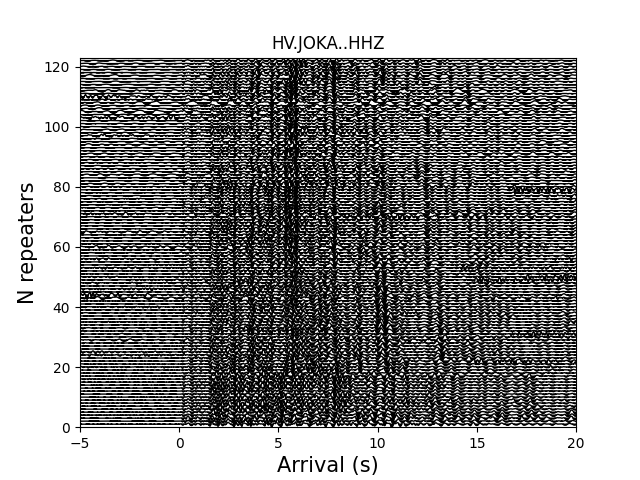
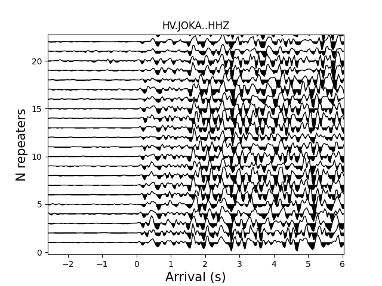

# RepEQ
### Event based or template-matching repeating earthquake searching and analyzing tool

****
What it can/cannot do
```
-[x] Download USGS catalog 
-[x] Download event-based data or continuous data
-[x] Event based repeating earthquake searching (with unknown arrival picks)
    i.e. RepEQ predict travel time arrival by a user defined velocity model.
-[x] Continuous data based repeating earthquake searching with the ANSS(USGS) picks
-[x] Coda waves interferometry
-[-] Earthquake relocation (Beta)
```

> Example of template-matching method for repeating earthquake detections in the Hawaiian Big Island 
<p float="left">
  
   
</p>

(left) Example waveforms at the station JOKA; (right) Zoom-in view of the waveforms

****
## 1. Installation
> RepEQ uses phase picks from the ANSS(USGS) catalog, so make sure install [libcomcat][] first 

#### cd to the place where you want to put the source code  
```console
cd Your_Local_Path  
git clone https://github.com/jiunting/RepEQ.git
```

#### Add RepEQ to PYTHONPATH

> Go to your environval variable file (.base_profile or .bashrc)  
```console
vi ~/.bashrc  
```
> or  
```console
vi ~/.bash_profile      
```
> and add the following line in the file

```bash
#set MLARGE
export PYTHONPATH=$PYTHONPATH:YOUR_PATH_MARGE/RepEQ/src/python
```

## 2. Download catalog  
#### 2-1 RepEQ uses USGS's API to download events (libcomcat not required)  
> Simply copy example file control.py and modify the parameters for event based catalog.  
```python
#in control file
download_tools.catalog_USGS(cata_times,cata_area,cata_magnitude,cata_out)
```
>The function takes 4 inputs  

|Variable Name  |Meaning |
| :---------- | :-----------|
| cata_times   |<array or list; len=2; dtype=str or datetime> i.e. [t1,t2] the begining and ending of catalog. |
| cata_area   |<array or list; len=4; dtype=float> area defined by 4-points [lon_min, lon_max, lat_min, lat_max]   |
| cata_magnitude   |<array or list; len=2; dtype=float> magnitude range [mag_min, mag_max]   |
| cata_name   |<str> output name   |

#### 2-2 RepEQ can also generate fake catalog for downloading continuous data later
> Copy example file control_cont.py and modify the parameters. 
```python
#in control file
download_tools.make_catalog(times=[cata_times[0],cata_times[1]],dt=dt,lon_lat=lon_lat,outname=cata_out)
```
> The function is similar to example 2-1 except the dt, which controls the sampling interval of the generated time.  
> For daily data, set dt=86400.

## 3. Download waveforms
#### 3-1 RepEQ download waveforms based on the catalog generated from the above. Waveforms can be either chunks of data (event-based) or continuous data (everything)
> Copy example file control.py or control_cont.py then set the time (i.e. how long the timeseries to be downloaded) and filter (i.e. which event should be downloaded)
```python
#in control file
download_tools.download_waves_catalog(cata_out,cata_filters,sec_bef_aft,range_rad,channel,provider,waveforms_outdir)
```
> Default output directory is home/project_name/waveforms 

[libcomcat]:https://github.com/usgs/libcomcat "libcomcat is a project designed to provide a Python equivalent to the ANSS ComCat search API"
[rep_wave1]:./fig/Figure_1.png "example repeating earthquakes"
[rep_wave2]:./fig/Figure_2.png "zoom in view of figure1"

#### 3-2 Download templates for continuous data searching
> Copy example file control_cont.py, use the repeq.template module
```python
from repeq import template
T = template.Template(home,project_name,cata_name2,True,sampling_rate,filter=filter,tcs_length=[1,9],filt_CC=0.3,filt_nSTA=6,plot_check=True)
#set T.download = True
T.template_load()
> The template will be in the home/project_name/waveform_template
```

|Attribute Name  |Meaning |
| :---------- | :-----------|
| catalog |<str;> catalog name |
| download   |<boolean;> download the data or loading them from waveform_template |
| tcs_length   |<array or list; len=2; dtype=float> time series length before and after arrival |

## 4. Repeating earthquake searching
> Copy example file control.py  

#### 4-1 Event-based searching
> Copy example file control_cont.py, use the repeq.template module  


#### 4-2 Continuous data template matching
