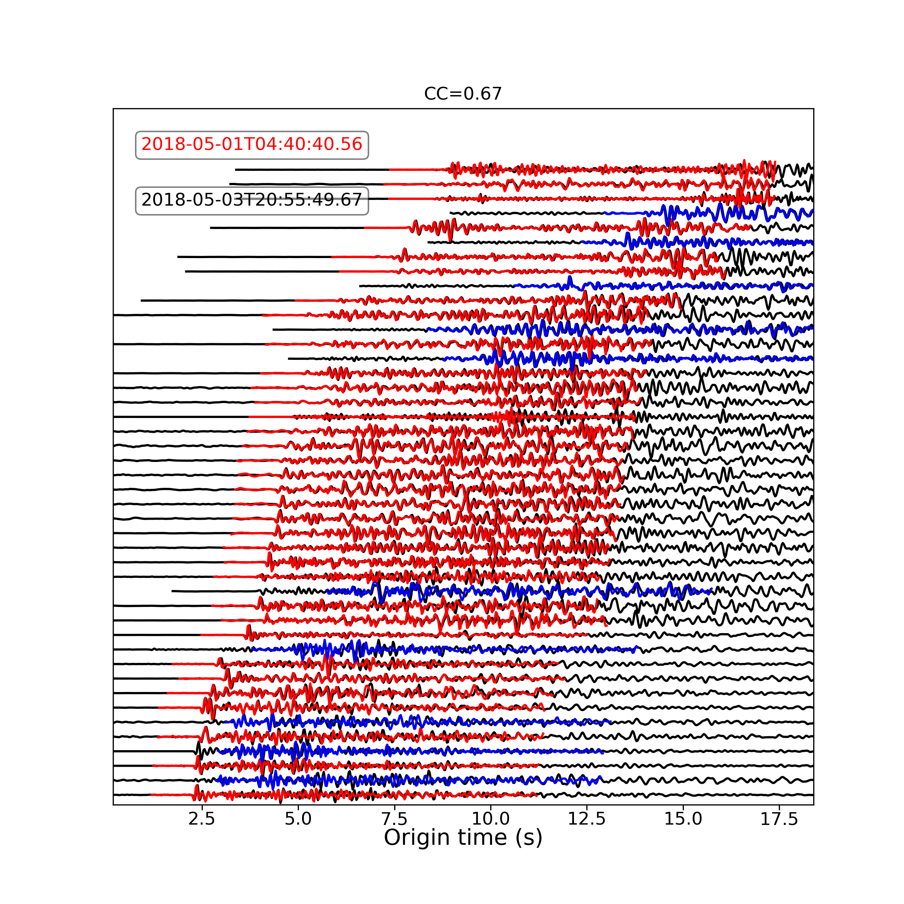
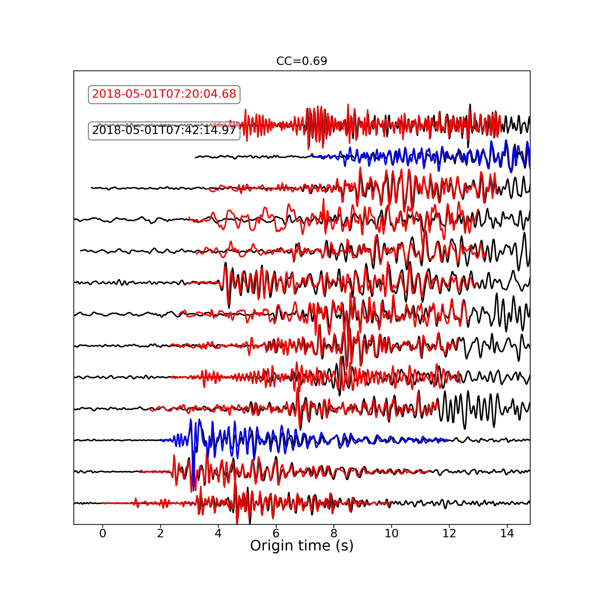

# RepEQ
### Event based or template-matching repeating earthquake searching and analyzing tool

****
What it can/cannot do
```
-[x] Download USGS catalog 
-[x] Download event-based data or continuous data
-[x] Event based repeating earthquake searching (with unknown arrival picks)
    i.e. RepEQ predict travel time arrival by a user defined velocity model.
-[x] Continuous data based repeating earthquake searching with the ANSS(USGS) picks
-[x] Coda waves interferometry
-[-] Earthquake relocation (Beta)
```
#### Important Updates
> (2020.12.14) Parallel processing cross-correlation template matching  
> (2020.12.09) Add chunk reading for ms > 2GB (automatically applied)  
> (2020.11.17) Add coda wave interferometry  
> (2020.11.13) Data visualization of waveforms  
> (2020.11.01) Add repeating earthquake relocation (iterative inversion method)  
> (2020.10.17) Add template download tool  
> (2020.10.06) Modify Mass_downloader  

#### Example of template-matching method for repeating earthquake detections in the Hawaiian Island 
<p float="left">
  
   
</p>

(left) Example waveforms at the station JOKA; (right) Zoom-in view of the waveforms

****
## 1. Installation
> RepEQ uses phase picks from the ANSS(USGS) catalog, so make sure install [libcomcat][] first 

#### cd to the place where you want to put the source code  
```console
cd Your_Local_Path  
git clone https://github.com/jiunting/RepEQ.git
```

#### Add RepEQ to PYTHONPATH

> Go to your environval variable file (.base_profile or .bashrc)  
```console
vi ~/.bashrc  
```
> or  
```console
vi ~/.bash_profile      
```
> and add the following line in the file

```bash
#set MLARGE
export PYTHONPATH=$PYTHONPATH:YOUR_PATH_MARGE/RepEQ/src/python
```

## 2. Download catalog  
#### 2-1 RepEQ uses USGS's API to download events (libcomcat not required)  
> Simply copy example file control.py and modify the parameters for event based catalog.  
```python
#in control file
download_tools.catalog_USGS(cata_times, cata_area, cata_magnitude, cata_out)
```
>The function takes 4 inputs  

|Variable Name  |Meaning |
| :---------- | :-----------|
| cata_times   |<array or list; len=2; dtype=str or datetime> i.e. [t1,t2] the begining and ending of catalog. |
| cata_area   |<array or list; len=4; dtype=float> area defined by 4-points [lon_min, lon_max, lat_min, lat_max]   |
| cata_magnitude   |<array or list; len=2; dtype=float> magnitude range [mag_min, mag_max]   |
| cata_name   |<str> output name   |

#### 2-2 RepEQ can also generate fake catalog for downloading continuous data later
> Copy example file control_cont.py and modify the parameters. 
```python
#in control file
download_tools.make_catalog(times=[cata_times[0], cata_times[1]], dt=dt, lon_lat=lon_lat, outname=cata_out)
```
> The function is similar to example 2-1 except the dt, which controls the sampling interval of the generated time.  
> For daily data, set dt=86400.

## 3. Download waveforms
#### 3-1 RepEQ download waveforms based on the catalog generated from the above. Waveforms can be either chunks of data (event-based) or continuous data (everything)
> Copy example file control.py or control_cont.py then set the time (i.e. how long the timeseries to be downloaded) and filter (i.e. which event should be downloaded)
```python
#in control file
download_tools.download_waves_catalog(cata_out, cata_filters, sec_bef_aft, range_rad, channel, provider, waveforms_outdir)
```
> Default output directory is home/project_name/waveforms 

[libcomcat]:https://github.com/usgs/libcomcat "libcomcat is a project designed to provide a Python equivalent to the ANSS ComCat search API"
[rep_wave1]:./fig/Figure_1.png "example repeating earthquakes"
[rep_wave2]:./fig/Figure_2.png "zoom in view of figure1"

#### 3-2 Download templates for continuous data searching
> Copy example file control_cont.py, use the repeq.template module
```python
from repeq import template

T = template.Template(home, project_name, cata_name2, True, sampling_rate, filter=filter, tcs_length=[1,9], filt_CC=0.3, filt_nSTA=6, plot_check=True)
#set T.download = True
T.template_load()  #load data or download data depends on T.download is True/False

```
> The template will be in the home/project_name/waveform_template  


|Attribute Name  |Meaning |
| :---------- | :-----------|
| catalog |<str;> catalog name |
| download   |<boolean;> download the data or loading them from waveform_template |
| tcs_length   |<array or list; len=2; dtype=float> time series length before and after arrival |

## 4. Repeating earthquake searching
### Now you have the waveforms what's next?

#### 4-1 For continuous data template matching
##### Copy example file control_cont.py, use the repeq.template module.

> Step 1. Before run the script, make sure you have downloaded template data in home/project_name/waveform_template/ and continuous data in home/project_name/waveform/ .  
> There are two ways to run calculation i)run directly or ii) multiprocessing which is highly recommended!
```python
# Run by multiprocessing
T = template.Template(home, project_name, cata_name2, False, sampling_rate, filter=filter, tcs_length=[1,9], filt_CC=0.3, filt_nSTA=6, plot_check=False)

# Set T.download = False, so T.template_load() will not download the templates again but load all the existing ms in the list
T.template_load()  #to show all the templates: print(T.ms)

# Decide how many multiprocessing
n_part = 8 #set 8 multiprocessing
T_part = template.T_partition(T,n_part=n_part) #partitioning the T
template.T_parallel(T_part, n_part=n_part, save_CCF=False, fmt=2) #parallel for all T_part


## if you insist or computer out-of-memory, here is the way to run them one-by-one
## T.template_load()
## T.xcorr_cont(save_CCF=False, fmt=2) #fmt=1 no longer supported

```
> The results will be saved in home/project_name/output/Template_match/Detections/

> Step 2. Make sure detections are robust.  
```python
from repeq import data_proc

#set some filter to the detections
filter_params={
    'diff_t':60,         #inter-event time >= 60 s
    'min_sta':6,         #minimum 6 stations (channels or phases)
    'min_CC':0.3         #minimum averaged CC
}

# cut the time series from filtered detections
data_proc.bulk_cut_dailydata(home, project_name, filter_detc, cut_window=[5,20])  #cut a longer time series for better plotting

# make figure from the above (cut) timeseries
from repeq import data_visual

data_visual.bulk_plot_detc_tcs(home, project_name, filter_detc)
```

<p float="left">
  
   
</p>


#### 4-2 For event-based searching
##### Copy example file control.py, make search=True then run. It has main 4 steps.  

> Step 1. Predict arrival time based on catalog and station location from a given velocity model, and calculate CC
```python
analysis.searchRepEQ(home, project_name, vel_model, cata_name, data_filters, startover=startover, make_fig_CC=make_fig_CC, QC=True, save_note=True)
```

> Step 2. Apply hash to merge the measurement into a large summary file
```python
analysis.read_logs(home, project_name) #merge all the .log file into a large summary file: project_name.summary
```

> Step 3. Link the summary file and find repeating earthquake sequence
```python
analysis.sequence(home, project_name, seq_filters) #make sequence file: project_name.summary
```

> Step 4. Furthermore, measure coda-wave interferometry
```python
analysis.measure_lag(home, project_name, lag_params, sequence_file, cata_name) #If A and B are repeating EQ, align P waves and measure their lags.  
```


